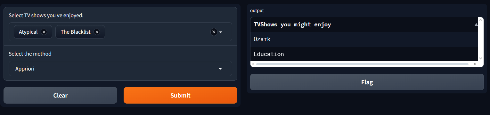

# Recommendation System for TV-shows 🎬

This system recommends tv-shows to watch based on the ones you liked, using Apriori and FP-growth association rules generated from the dataset `tv_shows` in Kaggle that showcases what tv-shows different people watch.
## Installation 🛠️
install the prerequisite through:

`pip install -r requirements.txt`

Then run this command:

 `python GradioAPP.py`
## Usage/Examples 🎞️

Here is an example of the recommendation of someone who has enjoyed and Atypical and The BlackList

  

## License 📜

[MIT](https://choosealicense.com/licenses/mit/)
